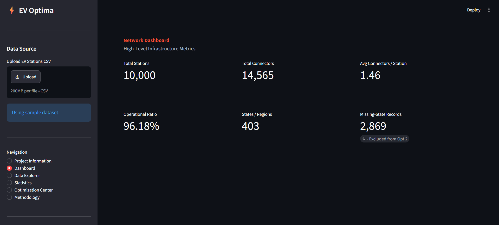

# EV Charging Optimization — Final 10 Changes Checklist

This document lists the recommended changes to make to the existing **EV Charging Infrastructure Optimization** repository before submitting it as the Operations Research course project.

The goal is to satisfy the professor's requirements clearly without rebuilding the project from scratch.

---

## Priority 1 — Must Do

### 1. Document the Exact Public Dataset Source

**Why:** The project requirement explicitly asks for the dataset chosen and its source.

Add a dedicated section to `README.md` containing:

- Exact dataset name
- Official/public source
- Dataset URL
- Access date
- License, if available
- Short description of the dataset
- Relevant columns used by the project

### Suggested README section

```md
## Dataset Source

**Dataset:** <Exact Dataset Name>

**Source:** <Official/Public Source>

**URL:** <Dataset URL>

**Accessed:** August 2026

**License:** <License>

### Dataset Description

The dataset contains publicly available EV charging-station records.
The project uses only variables actually present in the dataset and
does not assume unavailable demand, traffic, revenue, or population
variables.
```

**Important:** Do not invent or guess the source. Verify the exact origin of `ev_stations_2025.csv`.

---

### 2. Add CSV Upload to the Streamlit UI

**Why:** The professor says the user interface should allow data to be loaded.

Currently, the application relies on the repository's fixed CSV. Add:

- `Upload CSV`
- `Use Sample Dataset`

### Desired flow

```text
Data Source
    |
    +-- Upload CSV
    |
    +-- Use Sample Dataset
            |
            v
      Data Validation
            |
            v
       EDA / Statistics
            |
            v
       Optimization
```

### Required validation

Check for required columns such as:

```python
required_columns = [
    "lat",
    "lon",
    "state",
    "status",
    "operator",
    "num_connectors"
]
```

If columns are missing, show a clear error:

```text
Invalid dataset.

Missing required columns:
- lat
- lon
- num_connectors
```

This makes the dataset-loading requirement unambiguous.

---

### 3. Explicitly Map the Project to the OR Syllabus

**Why:** During evaluation/viva, the professor should immediately see which course topics are being applied.

Add this table to the README:

| Project Model | OR Topic | Technique |
|---|---|---|
| Charging Hub Location | Integer Programming / Facility Location / Set Covering | Binary MIP |
| Connector Allocation | Integer Programming / Resource Allocation | MILP / Max-Min |
| Parameter Testing | Sensitivity Analysis | Parameter/Sensitivity Analysis |

Describe Optimization 1 as:

> **Maximum Coverage Facility Location Problem**

Describe Optimization 2 as:

> **Max-Min Connector Allocation Problem**

This directly connects the implementation to the course syllabus.

---

# Priority 2 — Strongly Recommended

### 4. Add an Explicit Optimization Selection Interface

**Why:** The professor says at least two optimizations should be available and selectable by the user.

Create an **Optimization Center** in Streamlit.

Example:

```text
OPTIMIZATION CENTER

Choose the problem you want to solve:

+-----------------------------+
| Facility Location           |
| Maximum Coverage MIP        |
|                             |
| [ Select ]                  |
+-----------------------------+

+-----------------------------+
| Connector Allocation        |
| Max-Min Fairness MILP       |
|                             |
| [ Select ]                  |
+-----------------------------+
```

After selection:

```text
Selected Optimization
        |
        v
Parameters
        |
        v
Run Optimization
        |
        v
Results
```

This makes the professor's requirement visually obvious during the demonstration.

---

### 5. Strengthen the Statistics and Data-Quality Dashboard

The project already has EDA and statistics. Make the UI more explicit and useful.

Add a dataset summary such as:

```text
Rows                 10,000
Columns              <value>
Missing Values       <value>
Duplicate Rows       <value>
Operational Rate     96.18%
Mean Connectors      1.46
Median Connectors    <value>
Standard Deviation   <value>
```

For numerical variables, display:

- Count
- Mean
- Median
- Standard deviation
- Minimum
- 25th percentile
- 50th percentile
- 75th percentile
- Maximum

Also provide a **Missing Values** section.

Example:

```text
Missing Values

state             2,869
operator          <value>
num_connectors    <value>
lat               <value>
lon               <value>
```

Recommended visualizations:

- Connector distribution
- Operational status distribution
- Stations by state/region
- Operators by station count
- Geographic station map
- Connectors per station distribution

---

### 6. Add Baseline vs Optimized Comparison for Optimization 1

Optimization 2 already has useful baseline comparisons. Bring the same idea to Optimization 1.

Show:

| Metric | Baseline | Optimized | Improvement |
|---|---:|---:|---:|
| Covered Stations | X | X | +X |
| Coverage | X% | X% | +X% |
| Number of Hubs | X | X | — |

Also display:

```text
Baseline Coverage
        vs
Optimized Coverage
```

This makes the value of the optimization immediately understandable.

The professor should be able to see not only the solution, but **why the optimized solution is better**.

---

# Priority 3 — Documentation and Presentation Polish

### 7. Restructure the README for Academic Evaluation

Reorganize the README into an Operations Research project structure:

```text
# EV Charging Infrastructure Optimization

## 1. Problem Statement

## 2. Objectives

## 3. Dataset
### 3.1 Dataset Source
### 3.2 Dataset Description
### 3.3 Variables Used

## 4. Exploratory Data Analysis

## 5. Operations Research Formulation

### 5.1 Optimization 1 — Maximum Coverage Facility Location
### 5.2 Optimization 2 — Max-Min Connector Allocation

## 6. Mathematical Formulation

### 6.1 Decision Variables
### 6.2 Objective Function
### 6.3 Constraints

## 7. Solution Method

## 8. Sensitivity Analysis

## 9. Validation

## 10. Interactive User Interface

## 11. Results

## 12. Limitations

## 13. Conclusion

## 14. How to Run

## 15. References
```

The README should read like an academic OR project rather than only a software project.

---

### 8. Add UI Screenshots or a GIF

Add screenshots showing:

1. Dashboard
2. Dataset upload
3. Data statistics
4. EDA visualizations
5. Optimization 1
6. Optimization 2
7. Optimization results
8. Sensitivity analysis

Suggested README section:

```md
## Application Screenshots

### Dashboard


### Data Analysis


### Facility Location Optimization


### Connector Allocation Optimization

```

This will make the repository much easier for the professor to understand without running the application.

---

### 9. Add References and Project Resources

Create a clear `References` section in the README.

Include:

- Dataset source
- Dataset documentation
- Operations Research textbook/reference
- PuLP documentation
- Streamlit documentation
- Any mathematical optimization references used
- Any external geographic/data-processing references

Example:

```md
## References

1. <Dataset Name> — <Dataset Source>
2. Operations Research — <Textbook/Author>
3. PuLP Documentation — <Official Documentation>
4. Streamlit Documentation — <Official Documentation>
5. <Additional mathematical reference>
```

Do not add sources that were not actually used.

---

### 10. Add a License and Final Submission Metadata

If appropriate for the project, add a `LICENSE` file.

Also add a short project metadata section:

```md
## Project Information

**Course:** Operations Research

**Project Title:** EV Charging Infrastructure Optimization

**Domain:** Electric Vehicle Infrastructure

**Programming Language:** Python

**Optimization Framework:** PuLP

**User Interface:** Streamlit

**Optimization Models:** Mixed-Integer Linear Programming

**Team Size:** 4
```

Also ensure the final repository contains:

```text
ev-charging-optimization/
│
├── app.py
├── requirements.txt
├── README.md
├── LICENSE
│
├── data/
│   └── ev_stations_2025.csv
│
├── optimization/
│   ├── facility_location.py
│   └── connector_allocation.py
│
├── eda/
│   ├── EDA.ipynb
│   └── EDA_Process.md
│
├── validation/
│   └── ...
│
└── assets/
    ├── dashboard.png
    ├── data-analysis.png
    ├── facility-location.png
    └── connector-allocation.png
```

---

# Final Priority Order

If time is limited, implement the changes in this order:

| Priority | Change | Importance |
|---:|---|---|
| 🔴 1 | Verify and document public dataset source | Critical |
| 🔴 2 | Add CSV upload | Critical |
| 🔴 3 | Map models explicitly to OR syllabus | Critical |
| 🟡 4 | Add optimization selection interface | High |
| 🟡 5 | Strengthen statistics/data-quality dashboard | High |
| 🟡 6 | Add baseline vs optimized comparison | High |
| 🟢 7 | Restructure README | Medium |
| 🟢 8 | Add screenshots/GIF | Medium |
| 🟢 9 | Add references | Medium |
| 🟢 10 | Add license + project metadata | Medium |

---

# What NOT to Change

The current project already has the important mathematical core.

Do **not** add extra optimization algorithms merely to increase the number of techniques.

The existing two optimization models are sufficient:

### Optimization 1 — Maximum Coverage Facility Location

Conceptually:

\[
\max \sum_i z_i
\]

subject to facility-selection, coverage, and hub-budget constraints.

### Optimization 2 — Max-Min Connector Allocation

Conceptually:

\[
\max t
\]

where `t` represents the minimum connectors-per-station level across regions, subject to the connector budget and allocation constraints.

These two models already provide a strong connection to:

- Integer Programming
- Facility Location
- Set Covering / Maximum Coverage
- Resource Allocation
- Sensitivity Analysis

Adding TSP, AHP, nonlinear programming, etc. is unnecessary unless the project genuinely needs them.

---

# Final Target Architecture

```text
                 EV CHARGING OR SYSTEM
                          |
                          v
                +-------------------+
                | Dataset Loading   |
                |                   |
                | Upload CSV        |
                | OR Sample Dataset |
                +---------+---------+
                          |
                          v
                +-------------------+
                | Data Validation   |
                +---------+---------+
                          |
              +-----------+-----------+
              |                       |
              v                       v
        +-----------+           +-----------+
        |    EDA    |           | Statistics|
        +-----+-----+           +-----+-----+
              |                       |
              +-----------+-----------+
                          |
                          v
                +-------------------+
                | Optimization      |
                | Center            |
                +---------+---------+
                          |
              +-----------+-----------+
              |                       |
              v                       v
     +----------------+      +----------------+
     | Optimization 1 |      | Optimization 2 |
     |                |      |                |
     | Maximum        |      | Max-Min        |
     | Coverage       |      | Connector      |
     | Facility       |      | Allocation     |
     | Location MIP   |      | MILP           |
     +-------+--------+      +-------+--------+
             |                       |
             +-----------+-----------+
                         |
                         v
                +-------------------+
                | Validation &      |
                | Sensitivity       |
                +---------+---------+
                          |
                          v
                +-------------------+
                | Decision Support  |
                | Results           |
                +-------------------+
```

## Definition of Done

Before submission, the project should satisfy all of these:

- [ ] Public dataset source is explicitly documented
- [ ] Dataset can be uploaded through the UI
- [ ] Sample dataset remains available
- [ ] Dataset validation handles missing columns
- [ ] EDA/statistics can be generated from loaded data
- [ ] Optimization 1 can be selected and executed
- [ ] Optimization 2 can be selected and executed
- [ ] Both models are mapped to course topics
- [ ] Mathematical formulations are documented
- [ ] Baseline vs optimized results are shown
- [ ] Sensitivity analysis is demonstrated
- [ ] Validation/sanity checks are included
- [ ] README follows an academic project structure
- [ ] Screenshots demonstrate the UI
- [ ] Dataset and technical references are listed
- [ ] Project metadata/team information is complete

**Target:** After these changes, the repository should clearly demonstrate that it satisfies the Operations Research project requirements without unnecessarily increasing the mathematical or implementation complexity.
